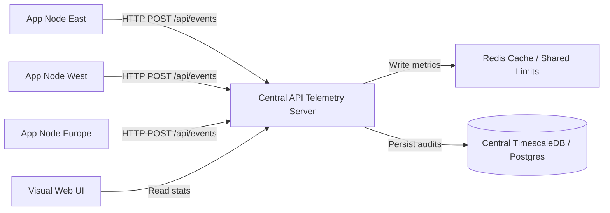

# Future Roadmap: Enterprise Distributed Telemetry & Scaling (`agent-atm`)

This document outlines the future design direction and architectural additions planned for `agent-atm` to support large-scale **Enterprise Distributed Telemetry** backends.

---

## 1. Distributed Telemetry Server Architecture

Currently, `agent-atm` supports writing to local SQLite database files. For enterprise microservice environments, `agent-atm` can be run as a centralized, scalable HTTP/gRPC telemetry daemon.

- **POST Telemetry API**: The server exposes `POST /api/events` enabling remote client SDKs to push token consumption events in real-time.
- **gRPC support**: For high-throughput/low-latency environments, a secondary gRPC endpoint is planned to reduce connection overhead.

---

## 2. Redis Database Manager (`RedisManager` - Planned v0.2.0)

For multi-process or multi-server app deployments, local memory or SQLite databases cannot share limits. We will implement `RedisManager`:
- **Shared Real-Time Rate Limiting**: App nodes query a centralized Redis cache to check token consumption over minute/hourly/daily windows.
- **Distributed Locks**: Prevents concurrent request race conditions from exceeding quotas.

---

## 3. Telemetry Buffering & Batching

To minimize network latency overhead on core LLM loops:
- **Client-Side Buffering**: The SDK will support client-side memory buffers that collect token events locally.
- **Asynchronous Bulk Pushes**: A background worker thread flushes events to the Central Telemetry Server in batches (e.g., every 5 seconds or when reaching 100 events) using a single HTTP POST request.

---

## 4. Distributed Limits & Quotas Engine

We will enhance the rules engine to support remote quota lookups:
- **Dynamic Rule Reloads**: The Central Telemetry Server acts as the source of truth for quotas. Clients poll or subscribe to quota updates.
- **Soft vs. Hard Limits**: Soft limits send Slack/PagerDuty warnings to departments, while hard limits return blocking `TokenQuotaExceeded` exceptions to client nodes.

---

## 5. Security, Authentication & Auditing

For secure enterprise integration:
- **API Keys & JWT**: All client posts are authenticated using custom API Keys or JSON Web Tokens (JWT).
- **Role-Based Dashboard Access (RBAC)**: Admins can view global graphs, while department leads can only view usage charts corresponding to their custom app IDs (e.g., `marketing` vs. `finance`).
