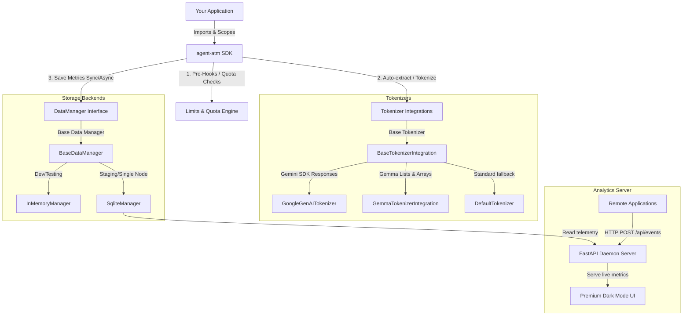

# Agent Token Manager (`agent-atm`)

[](https://pypi.org/project/agent-atm/)
[](https://pyproject.toml)
[](LICENSE)
[](tests/)

`agent-atm` is a lightweight, premium, **privacy-first** Python SDK designed to observe, measure, and cap LLM token consumption natively inside application workflows. 

Actively built for developers, it integrates natively with standard LLM providers (such as Google Gemini and Gemma models) to record precise token metrics, manage nested metadata scopes, and enforce strict daily/hourly/minute token budgets.

---

## ⚙️ Core Architecture



### 🔒 Privacy-First Guarantee
To ensure absolute user data protection, `agent-atm` **never stores raw prompt or response text** in its Data Managers. Inputs passed into the logging APIs are processed strictly in-memory to compute token counts and are then immediately discarded. The storage manager only persists numerical token counts, timestamps, model IDs, and user-scoped metadata.

---

## 🚀 Quick Start

### 1. Installation
```bash
pip install agent-atm
```

### 2. Simple Global Logger (Singleton-Style)
Perfect for standard scripts and single-tenant applications:

```python
import agent_atm as atm

# Initialize globally
atm.init(data_manager="sqlite", db_path="agent_atm.db", default_app_id="my-chatbot")

# Log user requests & model responses
atm.add_user_request("What is the capital of France?", model_id="gemini-2.5-flash")
atm.add_model_response("The capital of France is Paris.", model_id="gemini-2.5-flash")
```

### 3. Nested Scoping & Context Managers
Automatically inject session and metadata scoping across deeply nested function calls:

```python
with atm.context(
    session_id="session-abc-123", 
    username="vip-user", 
    _additional_metadata_tags=["production"],
    department="finance" # Custom metadata configs are dynamically parsed!
):
    # Seamlessly inherits session_id, username, tags, and department configs
    atm.add_user_request("How does compound interest work?", model_id="gemini-2.5-pro")
```

### 4. Direct `LLMPayload` Dataclass Logging
For advanced configurations, wrap LLM inputs in an explicit `LLMPayload` object:

```python
from agent_atm.types import LLMPayload

payload = LLMPayload(
    content="Evaluate option volatility index.",
    model_id="gemini-pro",
    token_count_override=150,
    _additional_metadata_tags=["options-trading"],
    _additional_metadata_config={"priority": "high"}
)
atm.add_user_request(payload)
```

---

## 🛠️ Advanced Features

### 🛡️ Token Quota Limits & Budget Enforcement
strictly prevent API budget overrun by matching token usage against minute, hourly, or daily quotas. Breaching a blocking limit raises a `TokenQuotaExceeded` exception that you can catch to block further requests:

```python
# Limit free-tier users to 100 tokens per minute
atm.limits.add(
    scope=atm.Scope(user="free-tier"),
    quota=atm.Quota(minute_limit=100),
    alert_level=atm.AlertLevel.BLOCKING
)

with atm.context(username="free-tier"):
    try:
        # This call checks current 1-minute usage first. If >100, it raises exception
        atm.add_user_request("Very long text...", token_count=120)
    except atm.TokenQuotaExceeded as e:
        print(f"API access capped: {e}")
```

### 🪝 Pre and Post Hooks Registry
Register custom callback validators or alert systems that execute around the event recording pipeline:

```python
@atm.hook("pre")
def pre_save_audit(event):
    # Mutate or validate telemetry BEFORE it's written
    event._additional_metadata_tags.append("audited")

@atm.hook("post")
def slack_webhook(event):
    # Trigger Slack alerts or external notifications AFTER the write
    if event.token_count > 5000:
        send_slack_alert(f"Large consumption: {event.token_count} tokens")
```

---

## 📊 Real-Time Telemetry Dashboard

Launch the FastAPI daemon server to view real-time token consumption trend lines, app allocations, top-using accounts, and live logs inside a premium, dark-mode visual dashboard:

```bash
ATM_DB_PATH=agent_atm.db uvicorn agent_atm.dashboard.server:app --reload
```

Open your web browser to **`http://127.0.0.1:8000`** to watch the visual metrics update in real-time.

---

## 📖 Additional Guides

* **[GEMINI.md](GEMINI.md)**: Google Gemini & Gemma Tokenizer Developer Integration Guide.
* **[CONTRIBUTING.md](CONTRIBUTING.md)**: Development Setup, Contribution Guidelines, and Testing Suite Instructions.
