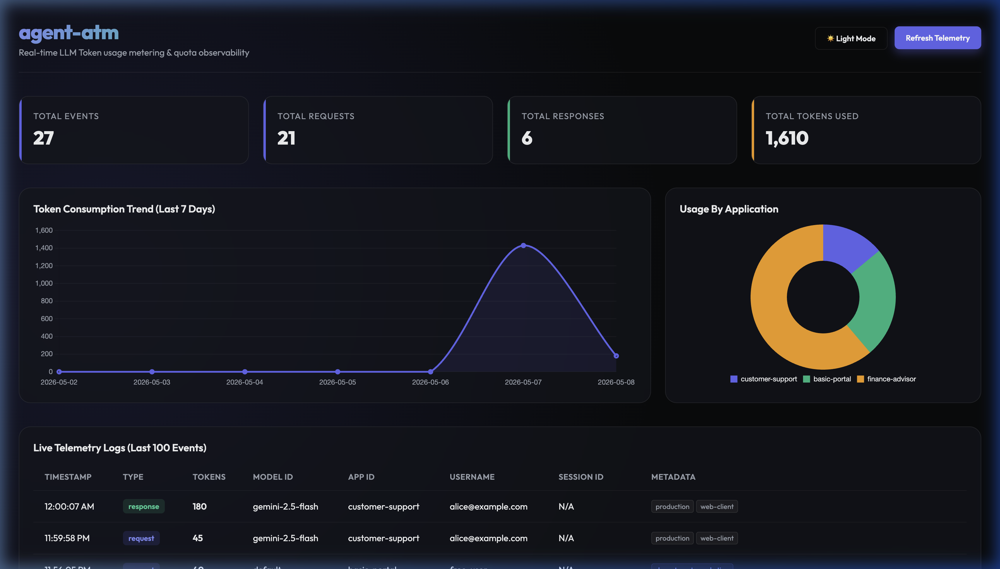

# Agent Token Manager (`agent-atm`)

[](https://pypi.org/project/agent-atm/)
[](https://pyproject.toml)
[](LICENSE)
[](tests/)

`agent-atm` is a lightweight, **privacy-first** Python SDK built to monitor, measure, and cap LLM token consumption natively inside application workflows.

Designed as a high-performance observability and control utility for agentic systems, it plugs seamlessly into any model or agent framework to **record precise token metrics**, manage nested metadata scopes, and **enforce real-time budget quotas** over daily, hourly, or minute-level windows.

**Disclaimer:**
1. This is not official Google Cloud product
2. This is a experimental idea
3. This is for solving my Token Problem (lack of usage controls)

---

## ✨ Key Features

* **Plug-and-Play Observability**: An intuitive API designed to feel as familiar as Python's standard logging library.
* **Extensible Interface Architecture**: Built on clean, developer-friendly abstractions (interfaces for storage managers and tokenizers), making custom integrations simple.
* **Privacy-First Guarantee**: **Zero raw prompt or response text storage**. All incoming text is parsed strictly in-memory to calculate token metrics and instantly discarded.
* **Flexible Storage Managers**: Shipped with a thread-safe `InMemoryManager`, a robust `SQLAlchemyManager` for persistent local deployments, and a `RemoteHTTPDataManager` for distributed telemetry.
* **Centralized Telemetry Daemon**: A built-in FastAPI server serving as a centralized collector to asynchronously gather token events from distributed client instances.
* **Premium Visual Analytics**: A modern, interactive dark-mode dashboard to view token trends, audit active configurations, and track live budget allocations.

---

## 🚀 Quick Setup

Get up and running in less than 60 seconds using either the local SDK or a centralized standalone telemetry server.

### 1. Installation

Install from PyPI:
```bash
pip install agent-atm
```

Or install directly from GitHub:
```bash
pip install git+https://github.com/msampathkumar/agent_atm.git
```


---

### 2. Setup Storage & Record Telemetry
Perfect for Python applications running in-process. Initialize the SQLite storage engine and begin logging request and response telemetry:

```python
import agent_atm as atm

# Initialize local persistent database with in-memory quota caching
atm.init(data_manager="sqlite", db_path="agent_atm.db", default_app_id="customer-bot", quota_cache="memory")

# Record a request event with token count and tags
atm.add_user_request(token_count=32, _additional_metadata_tags=["user-prompt"])

# Record a response event with token count and tags
atm.add_model_response(token_count=120, _additional_metadata_tags=["gemini-response"])
```


> **Granular Observability**: For token usage analysis, atm allow the recording of context attributes like, `model_id`, `username`, `session_id`, `app_id`, `token_count`, list tags (`_additional_metadata_tags`), and arbitrary key-value config dicts (`_additional_metadata_config`).

#### Feature: Direct `LLMPayload` Dataclass Logging
For advanced configurations, wrap LLM inputs in an explicit `LLMPayload` object:

```python
from agent_atm.types import LLMPayload

payload = LLMPayload(
    token_count_override=45,
    model_id="example-model",
    event_type="request",  # or "response"
    _additional_metadata_tags=["dev-test"],
    _additional_metadata_config={"node_id": "emea-east-1"}
)
atm.add_user_request(payload)
```

#### Feature: Nested Context Scoping
Cascade session IDs, user attributes, and tags cleanly across deeply nested function calls without passing parameters down the stack:

```python
with atm.context(
    session_id="session-abc-123", 
    username="vip-user", 
    _additional_metadata_tags=["production"],
    department="finance" # Custom key-value configs are dynamically captured!
):
    # Seamlessly inherits session_id, username, tags, and department configs
    atm.add_user_request("How does compound interest work?", model_id="gemini-2.5-pro")
```

#### Feature: Native Google Gemini Observability
When passing a real `google-genai` SDK client response, `agent-atm` automatically extracts precise metrics directly from the native Google usage metadata:

```python
import os
from google import genai
import agent_atm as atm

# 1. Initialize ATM
atm.init(data_manager="sqlite", db_path="usage.db")

# 2. Initialize standard GenAI client
client = genai.Client(api_key=os.environ["GEMINI_API_KEY"])

# 3. Track LLM workflow
with atm.context(session_id="sess-vip-99", username="alice@example.com"):
    prompt = "Draft a professional email response regarding refund query."
    
    # Count and log the request prompt
    atm.add_user_request(prompt, model_id="gemini-2.5-flash")
    
    # Call Gemini
    response = client.models.generate_content(
        model="gemini-2.5-flash",
        contents=prompt,
    )
    
    # Record native response: ATM auto-extracts exact candidate and prompt counts from usage_metadata!
    atm.add_model_response(response, model_id="gemini-2.5-flash")
```

---

### 3. Pure Web API Style: Central Telemetry Server & curl Commands
Perfect for enterprise microservice environments. Run the `agent-atm` server standalone and report events from **any programming language** via standard REST HTTP requests:

#### Launch the Standalone Telemetry Daemon:
```bash
uv run agent_atm --db-path agent_atm.db --host 127.0.0.1 --port 8000

```

#### Push Telemetry via curl (fully independent of Python/SDK):
```bash
# Log a User Request Event
curl -X POST http://127.0.0.1:8000/api/events \
  -H "Content-Type: application/json" \
  -d '{
    "event_type": "request",
    "token_count": 45,
    "model_id": "gemini-2.5-pro",
    "username": "alice@company.com",
    "session_id": "session-abc-999",
    "app_id": "finance-agent",
    "tags": ["api-call", "production"],
    "config": {"node_id": "aws-east-1"}
  }'

# Log a Model Response Event
curl -X POST http://127.0.0.1:8000/api/events \
  -H "Content-Type: application/json" \
  -d '{
    "event_type": "response",
    "token_count": 180,
    "model_id": "gemini-2.5-pro",
    "username": "alice@company.com",
    "session_id": "session-abc-999",
    "app_id": "finance-agent",
    "tags": ["api-response", "production"]
  }'
```

---

## 🤖 Native Tokenizer Integrations

For specific families like **Google Gemini** (`google-genai` SDK) and **Google Gemma** (`Gemma3Tokenizer`), `agent-atm` provides **in-built tokenizer mappings**. 

Instead of calculating token counts manually, you can pass the raw string `content` directly and let the SDK compute and track metrics automatically:

```python
# Pass the raw prompt: ATM automatically tokenizes and counts the metrics under the hood!
atm.add_user_request("Explain quantum computing in simple terms.", model_id="gemma-3")
```

> [!TIP]
> **Custom Tokenizer Extensibility**: Using another provider? Check our baseline **[BaseTokenizerIntegration](file:///Users/sampathm/github/agent_token_manager/agent_atm/tokenizers/base.py)** class to see how easy it is to implement a custom tokenizer module.

---

## 🛡️ ATM Controls: Rules, Hooks & Quota Caps

Take complete control of your LLM consumption using reactive quota caps and custom event interceptors:

### 1. Dynamic Quota Budgeting
Enforce strict token ceilings over minute, hourly, or daily windows per user or app scope. Exceeding a blocking quota raises a `TokenQuotaExceeded` exception, allowing you to gracefully handle and reject further LLM calls:
```python
# Limit free-tier users to 500 tokens per minute
atm.limits.add(
    scope=atm.Scope(user="free-tier"),
    quota=atm.Quota(minute_limit=500),
    alert_level=atm.AlertLevel.BLOCKING
)

with atm.context(username="free-tier"):
    try:
        # If minute consumption exceeds 500, this raises TokenQuotaExceeded
        atm.add_user_request("Some very long prompt text...", token_count=600)
    except atm.TokenQuotaExceeded as e:
        print(f"Request Blocked: {e}")
```

### 2. Pre & Post Hook Interceptors
Register custom hook decorators to validate contexts, mutate event scopes, or trigger asynchronous notifications (like Slack webhooks) around database writes:
```python
@atm.hook("pre")
def pre_save_audit(event):
    # Mutate or validate event metadata BEFORE the database write
    event._additional_metadata_tags.append("audited")

@atm.hook("post")
def slack_alert(event):
    # Trigger non-blocking alerts AFTER the event is successfully written
    if event.token_count > 10000:
        trigger_slack_notification(f"Warning: High token consumption detected: {event.token_count}")
```

---

## 📊 Real-Time Analytics Dashboard

Start the telemetry metrics daemon to view real-time consumption trend lines, aggregate app metrics, top-consuming users, and live event telemetry logs inside a premium visual dashboard:

```bash
uv run agent_atm --db-path agent_atm.db --host 127.0.0.1 --port 8000

```

Open your web browser to **`http://127.0.0.1:8000`** to access the visual console.

---

## 📖 Additional Resources

* **[GEMINI.md](file:///Users/sampathm/github/agent_token_manager/GEMINI.md)**: Native Gemini & Gemma Tokenizer Integration Handbook.
* **[CONTRIBUTING.md](file:///Users/sampathm/github/agent_token_manager/CONTRIBUTING.md)**: Contribution Rules, Virtual Env Setup, and Automated Testing Suite Guide.
* **[FUTURE.md](file:///Users/sampathm/github/agent_token_manager/FUTURE.md)**: TimescaleDB, Distributed Redis Lock, and Remote Buffer scaling roadmaps.
