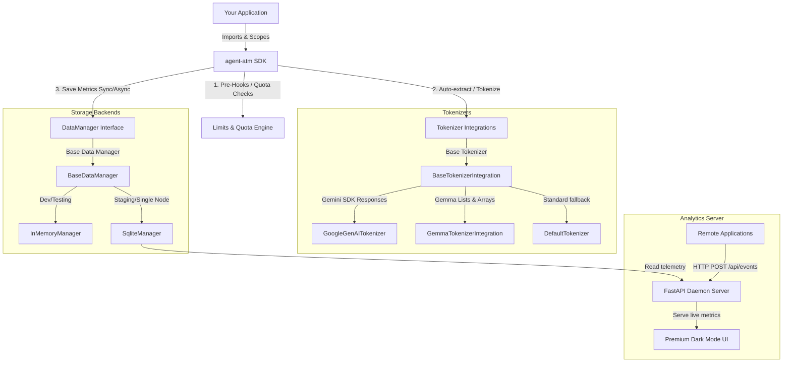

# Agent Token Manager (`agent-atm`)

[](https://pypi.org/project/agent-atm/)
[](https://pyproject.toml)
[](LICENSE)
[](tests/)

`agent-atm` is a lightweight, premium, **privacy-first** Python SDK designed to observe, measure, and cap LLM token consumption natively inside application workflows. 

Actively built for developers, it integrates natively with standard LLM providers (such as Google Gemini and Gemma models) to record precise token metrics, manage nested metadata scopes, and enforce strict daily/hourly/minute token budgets.

---

## 🎯 Alignment: What to Expect & What NOT to Expect

To help you get started quickly and correctly, here is a clear overview of what `agent-atm` is and isn't designed to do:

### 🟢 What to Expect
* **Native SDK Integration**: A lightweight Python SDK running directly inside your application (no heavy external sidecars required).
* **Automatic Token Extraction**: Natively parses Google GenAI (`google-genai`) response objects and extracts prompt/candidate counts directly from `usage_metadata`.
* **Gemma Tokenizer Support**: Complete out-of-the-box compatibility with Google DeepMind's `Gemma3Tokenizer` and raw sampling outputs (arrays/lists).
* **Nested Metadata Scoping**: A clean `with atm.context(...)` manager to automatically cascade tags, session IDs, and customer tiers across nested function blocks.
* **Strict Quota Capping**: Automatic in-memory checks that can raise blocking exceptions when daily, hourly, or minute-level budgets are exceeded.
* **Absolute Privacy**: **Zero prompt/response storage**. Inputs are processed strictly in-memory to compute token counts and then instantly garbage collected.
* **Fast, Modern Setup**: Zero-configuration developer onboarding powered by the ultra-fast `uv` Python toolchain.

### 🔴 What NOT to Expect
* **Not a Proxy / Gateway**: `agent-atm` does not intercept your raw network requests or act as an intermediate server between your application and Google Gemini.
* **No Automatic Interception**: It does not auto-monkeypatch standard HTTP libraries; event telemetry is logged voluntarily via SDK calls (`add_user_request` / `add_model_response`) or explicit decorators.
* **Not an LLM Orchestrator**: It does not manage model parameters, retries, temperature, or text generation.
* **Not a Persistent Content Vault**: Because of its privacy-first guarantee, you cannot retrieve raw prompt strings later; only numerical counts and metadata tags are recorded.

---

## ⚙️ Core Architecture



### 🔒 Privacy-First Guarantee
To ensure absolute user data protection, `agent-atm` **never stores raw prompt or response text** in its Data Managers. Inputs passed into the logging APIs are processed strictly in-memory to compute token counts and are then immediately discarded. The storage manager only persists numerical token counts, timestamps, model IDs, and user-scoped metadata.

---

## 🚀 Quick Start

Get up and running in less than 60 seconds.

### 1. Installation

For a lightning-fast setup, we recommend using **`uv`** (the ultra-fast Python packaging tool):

```bash
# Install in your project
uv add agent-atm
```

*(Alternatively, use standard pip: `pip install agent-atm`)*

### 2. Simple Global Logger (Singleton-Style)
Perfect for standard scripts and single-tenant applications:

```python
import agent_atm as atm

# Initialize globally
atm.init(data_manager="sqlite", db_path="agent_atm.db", default_app_id="my-chatbot")

# Option 1: Log user requests & model responses with token_count
atm.add_user_request(token_count=50, model_id="gemini-2.5-flash")
atm.add_model_response(token_count=150, model_id="gemini-2.5-flash")

# Option 2: Log user requests & model responses  with content (for supported models & available tokenizers)
atm.add_user_request("What is the capital of France?", model_id="gemini-2.5-flash")
atm.add_model_response("The capital of France is Paris.", model_id="gemini-2.5-flash")
```

### 3. Logging Token Counts Directly (No Text Content)
If you already have the exact token counts (e.g., from a model provider's response API) or wish to keep prompt/response text completely out of the SDK, you can log the token count directly without passing any text or content placeholder parameters:

```python
# Log token metrics directly
atm.add_user_request(token_count=150, model_id="gemini-2.5-flash")
atm.add_model_response(token_count=320, model_id="gemini-2.5-flash")
```
This completely bypasses all in-memory tokenizer integrations and registers your exact token budgets instantly.

### 4. Deeply Nested Context Scoping
Cascade session IDs, user attributes, and tags cleanly across deeply nested function calls without passing parameters down the stack:

```python
with atm.context(
    session_id="session-abc-123", 
    username="vip-user", 
    _additional_metadata_tags=["production"],
    department="finance" # Custom key-value configs are dynamically captured!
):
    # Seamlessly inherits session_id, username, tags, and department configs
    atm.add_user_request("How does compound interest work?", model_id="gemini-2.5-pro")
```
### 4. Direct `LLMPayload` Dataclass Logging
For advanced configurations, wrap LLM inputs in an explicit `LLMPayload` object:

```python
from agent_atm.types import LLMPayload

payload = LLMPayload(
    content="Evaluate option volatility index.",
    model_id="gemini-pro",
    token_count_override=150,
    _additional_metadata_tags=["options-trading"],
    _additional_metadata_config={"priority": "high"}
)
atm.add_user_request(payload)
```

### 4. Native Google Gemini Observability
When passing a real `google-genai` SDK client response, `agent-atm` automatically extracts precise metrics directly from the native Google usage metadata:

```python
import os
from google import genai
import agent_atm as atm

# 1. Initialize ATM
atm.init(data_manager="sqlite", db_path="usage.db")

# 2. Initialize standard GenAI client
client = genai.Client(api_key=os.environ["GEMINI_API_KEY"])

# 3. Track LLM workflow
with atm.context(session_id="sess-vip-99", username="alice@example.com"):
    prompt = "Draft a professional email response regarding refund query."
    
    # Count and log the request prompt
    atm.add_user_request(prompt, model_id="gemini-2.5-flash")
    
    # Call Gemini
    response = client.models.generate_content(
        model="gemini-2.5-flash",
        contents=prompt,
    )
    
    # Record native response: ATM auto-extracts exact candidate and prompt counts from usage_metadata!
    atm.add_model_response(response, model_id="gemini-2.5-flash")
```

---


## 🛠️ Advanced Features

### 🛡️ Token Quota Limits & Budget Enforcement
strictly prevent API budget overrun by matching token usage against minute, hourly, or daily quotas. Breaching a blocking limit raises a `TokenQuotaExceeded` exception that you can catch to block further requests:

```python
# Limit free-tier users to 100 tokens per minute
atm.limits.add(
    scope=atm.Scope(user="free-tier"),
    quota=atm.Quota(minute_limit=100),
    alert_level=atm.AlertLevel.BLOCKING
)

with atm.context(username="free-tier"):
    try:
        # This call checks current 1-minute usage first. If >100, it raises exception
        atm.add_user_request("Very long text...", token_count=120)
    except atm.TokenQuotaExceeded as e:
        print(f"API access capped: {e}")
```

### 🪝 Pre and Post Hooks Registry
Register custom callback validators or alert systems that execute around the event recording pipeline:

```python
@atm.hook("pre")
def pre_save_audit(event):
    # Mutate or validate telemetry BEFORE it's written
    event._additional_metadata_tags.append("audited")

@atm.hook("post")
def slack_webhook(event):
    # Trigger Slack alerts or external notifications AFTER the write
    if event.token_count > 5000:
        send_slack_alert(f"Large consumption: {event.token_count} tokens")
```

---

## 📊 Real-Time Telemetry Dashboard

Launch the FastAPI daemon server to view real-time token consumption trend lines, app allocations, top-using accounts, and live logs inside a premium, dark-mode visual dashboard:

```bash
ATM_DB_PATH=agent_atm.db uvicorn agent_atm.dashboard.server:app --reload
```

Open your web browser to **`http://127.0.0.1:8000`** to watch the visual metrics update in real-time.

---

## 📖 Additional Guides

* **[GEMINI.md](GEMINI.md)**: Google Gemini & Gemma Tokenizer Developer Integration Guide.
* **[CONTRIBUTING.md](CONTRIBUTING.md)**: Development Setup, Contribution Guidelines, and Testing Suite Instructions.
