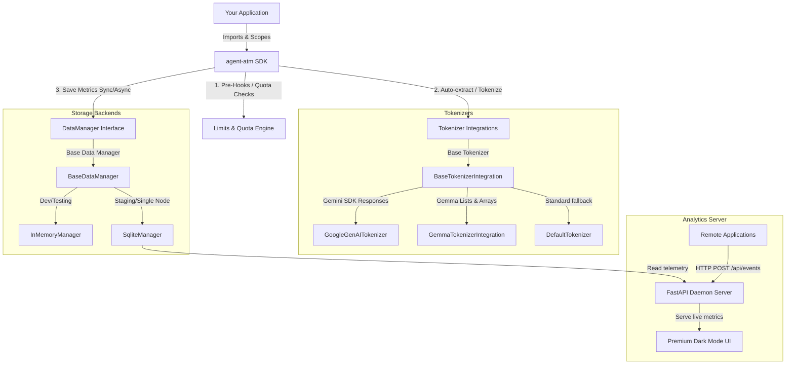

# Agent Token Manager (`agent-atm`) Design Document

A premium, lightweight, privacy-first Python SDK designed to measure, observe, and control LLM token consumption at the application level.

---

## 1. Architecture Overview

`agent-atm` is structured to run inside application logic, acting as a middleware-like wrapper or logger. By default, it prioritizes **privacy** (never storing raw prompt/response text) and **reliability** (synchronous writes by default, with optional asynchronous background execution).

### System Component Diagram


## ⚙️ Core Architecture



### Privacy-First Guarantee
To guarantee user privacy, `agent-atm` **never stores raw prompt or response text**. Raw text or response objects passed into the SDK are used strictly in-memory to compute token counts (via local tokenizers or native SDK response fields) and are then immediately discarded. The `DataManager` only persists:
- Event metadata (Timestamp, Event Type: Request or Response, Model ID)
- Context fields (Username, Session ID, App ID, Hostname, Tags)
- Token Counts (Input Tokens, Output Tokens, Total Tokens)

---

## 2. Core SDK API Design

The SDK supports both a standard **singleton-like import** (similar to python's `logging` module) for quick start, and **explicit instantiation** for complex, multi-tenant environments.

### 2.1. Initialization & Configuration
```python
import agent_atm as atm

# Configure the default singleton instance
atm.init(
    data_manager="in_memory",  # Options: "in_memory", "sqlite" (natively supported), "redis" (future v0.2.0)
    async_write=False,         # True for background worker queue
    default_app_id="my-awesome-app"
)
```

### 2.2. Explicit Client Instantiation
```python
from agent_atm import AgentTokenManager

atm_client = AgentTokenManager(
    data_manager=InMemoryManager(),
    async_write=True
)
```

### 2.3. Recording Token Usage
Developers manually log request and response events by passing the text, custom token count overrides, or native SDK objects.

```python
# Recording user request
atm.add_user_request(
    text="What is the capital of France?",
    model_id="gemini-2.5-pro",
    username="alice@example.com",
    session_id="session-987",
    tags=["prod", "chat"]
)

# Recording model response with explicit token override
atm.add_model_response(
    text="The capital of France is Paris.",
    token_count=7,
    model_id="gemini-2.5-pro",
    username="alice@example.com",
    session_id="session-987"
)
```

### 2.4. Scope & Metadata Context Manager
To prevent developers from repeating metadata arguments in every single call, `agent-atm` supports `context` scoping via Context Managers (utilizing thread-local / async-local `ContextVar`).

```python
# Enrich all calls inside this block with app, session, and user metadata
with atm.context(app_id="finance-bot", session_id="session-abc-123", username="bob"):
    
    # Automatically inherits app_id, session_id, and username
    atm.add_user_request("Analyze portfolio risk.", model_id="gemini-2.5-flash")
    
    response = call_llm("Analyze portfolio risk.")
    
    atm.add_model_response(response, model_id="gemini-2.5-flash")
```

---

## 3. Data Manager Abstraction

Every record is structured into a unified model:

```python
from dataclasses import dataclass, field
from datetime import datetime
from typing import Dict, List, Literal, Optional

@dataclass
class TokenEvent:
    """Core immutable telemetry record representing a captured token consumption event.
    
    Validated on creation via __post_init__ to ensure event_type is either
    "request" or "response" (throws ValueError otherwise).
    """
    # Essentials
    timestamp: datetime
    event_type: Literal["request", "response"]  # "request" or "response"
    token_count: int
    model_id: str
    
    # Optionals
    username: Optional[str] = None
    session_id: Optional[str] = None
    app_id: Optional[str] = None
    hostname: Optional[str] = None
    
    # Standardized Metadata
    _additional_metadata_tags: List[str] = field(default_factory=list)
    _additional_metadata_config: Dict[str, str] = field(default_factory=dict)

    def __post_init__(self):
        if self.event_type not in ("request", "response"):
            raise ValueError(f"Invalid event_type: '{self.event_type}'")
```

### 3.1. Base Class (`BaseDataManager`)
All concrete storage backends must inherit from this class:

```python
from abc import ABC, abstractmethod

class BaseDataManager(ABC):
    @abstractmethod
    def save(self, event: TokenEvent) -> None:
        """Persist a single token event."""
        pass

    @abstractmethod
    def get_usage(
        self, 
        app_id: Optional[str] = None, 
        username: Optional[str] = None, 
        session_id: Optional[str] = None,
        start_time: Optional[datetime] = None,
        end_time: Optional[datetime] = None
    ) -> int:
        """Retrieve total consumed tokens filtered by scope and time window."""
        pass
```

### 3.2. Concrete Implementations
1. **`InMemoryManager`**: Stores events in an internal thread-safe list. Best for development and local testing.
2. **`SqliteManager`**: Fully implemented, robust local SQLite database storage for single-instance local metrics persistence.
3. **`RedisManager` (v0.2.0)**: Planned distributed key-value storage for multi-process/multi-server setups needing shared real-time rate limits.


---

## 4. Hook & Quota Limit Engine

Hooks allow executing validation checks or external notification logic before and after saving metrics.

### 4.1. Pre-Hooks and Post-Hooks
- **Pre-Hooks**: Executed *before* storing the event. Can modify metadata or cancel/block operations by raising exceptions.
- **Post-Hooks**: Executed *after* storing the event. Always non-blocking, suitable for alerts, async reporting, or webhooks.

```python
# Custom Hook registration
@atm.hook(type="pre")
def validate_user_department(event: TokenEvent):
    if not event.username:
        raise ValueError("Username is required for auditing.")

@atm.hook(type="post")
def alert_on_high_usage(event: TokenEvent):
    if event.token_count > 5000:
        trigger_slack_alert(f"Large request of {event.token_count} tokens!")
```

### 4.2. Quota Limits Rule Engine
The quota limits engine lets developers register rules to cap token consumption over varying scopes and durations.

#### Rule Definition API
```python
atm.limits.add(
    scope=atm.Scope(app="*", user="Joe", session="*"),
    quota=atm.Quota(total_limit=1_000_000, day_limit=500_000, hour_limit=10_000),
    alert_level=atm.AlertLevel.BLOCKING  # Options: BLOCKING, WARNING
)
```

If `alert_level` is set to `BLOCKING`, a quota breach causes `add_user_request`/`add_model_response` to raise `TokenQuotaExceeded`. This exception can be caught by the developer to reject further model calls.

---

## 5. Tokenizer & Native SDK Integrations

To achieve auto-token counting, `agent-atm` defines custom tokenizer mappings.

### 5.1. Tokenizer Integrations Configuration
Instead of passing raw, anonymous `Any` objects to tokenizers, `agent-atm` passes a structured, explicit **`LLMPayload`** dataclass.

```python
from dataclasses import dataclass, field
from typing import Any, Dict, List, Literal, Optional

@dataclass
class LLMPayload:
    """Structured parameter wrapper passed to all Tokenizer Integrations.
    
    Validated on creation to ensure event_type is either 'request' or 'response'.
    Acts as the initial vehicle carrying content and parameters before conversion 
    to a final database-storable TokenEvent.
    """
    # Essentials
    content: Any  # Raw string, Google GenAI Response, Gemma token arrays, etc.
    
    # Optionals
    model_id: str = "default"
    token_count_override: Optional[int] = None
    event_type: Literal["request", "response"] = "request"
    
    # Standardized Metadata
    _additional_metadata_tags: List[str] = field(default_factory=list)
    _additional_metadata_config: Dict[str, str] = field(default_factory=dict)

    def __post_init__(self):
        if self.event_type not in ("request", "response"):
            raise ValueError(f"Invalid event_type: '{self.event_type}'")
```

All integrations inherit from the structured base class:
```python
class BaseTokenizerIntegration(ABC):
    @abstractmethod
    def can_handle(self, payload: LLMPayload) -> bool:
        """Determine if this integration can parse the payload's content."""
        pass

    @abstractmethod
    def extract_text_and_tokens(self, payload: LLMPayload) -> tuple[str, int]:
        """Extract raw text and token counts from the payload's content."""
        pass
```


Developers can register custom integration objects directly into `atm.tokenizer.integrations`.
For example, when calling:
```python
# When using the Google GenAI client:
response = client.models.generate_content(model='gemini-2.5-flash', contents='Hello')

# Automatically matches the GoogleGenAI integration wrapper to extract token metadata!
atm.add_model_response(response)
```

### 5.2. Gemma Tokenizer Native Support
`agent-atm` natively supports standard tokenizer wrappers like `Gemma3Tokenizer` from Google DeepMind's `gemma` package. 

It does this by providing:
- **Direct Import Alias Mapping**: Automatically binds `gemma.text` to the underlying `gemma.gm.text` module, enabling developer code to write:
  ```python
  from gemma.text import Gemma3Tokenizer
  ```
- **Universal Tokenizer Compatibility**: The `DefaultTokenizer` accepts a custom tokenizer in `atm.init(tokenizer=...)`. It dynamically uses the tokenizer's `.encode()` method to count tokens for any recorded prompts/responses.

```python
from gemma.text import Gemma3Tokenizer
import agent_atm as atm

# Initialize standard Google DeepMind Gemma3Tokenizer
tokenizer = Gemma3Tokenizer()

# Register it globally so ATM calculates exact tokens using it!
atm.init(data_manager="in_memory", tokenizer=tokenizer)
```

---


## 6. Metrics & Daemon Server (FastAPI)

To provide live usage insights, a daemon dashboard server is run independently.

### 6.1. Daemon API
The FastAPI daemon queries the shared SQLite database or Redis instance. It exposes REST endpoints:
- `GET /api/metrics`: Real-time aggregate stats.
- `GET /api/usage/by-app`: Token distribution per application.
- `GET /api/usage/by-user`: User-level consumption rankings.

### 6.2. Premium Dashboard UI
A modern, dynamic dashboard UI (Glassmorphism, Dark mode, Google Fonts integration, micro-animations) built with Tailwind CSS or vanilla CSS and vanilla JS is served directly by the FastAPI server at `/`.

---

## 7. Roadmap & Milestones

- **v0.1.0 (Core SDK & Local Storage) - [COMPLETED]**
  - Base SDK client & Singleton API (Completed)
  - `InMemoryManager` implementation (Completed)
  - Core Hook & Token Quota Rule Engine (Completed)
  - Google GenAI client integration (Completed)
  - SQLite Database Manager (`SqliteManager`) (Completed)
  - Gemma Tokenizer & Gemma3Tokenizer support (Completed)
  - FastAPI Telemetry API & Premium Dark Mode Web Dashboard (Completed)
- **v0.2.0 (Scale & Distributed Tracking) - [IN PROGRESS]**
  - Redis Database Manager (`RedisManager`) (Planned)
  - Dynamic Distributed limits capping & Remote Quotas (Planned)
  - Remote client bulk buffering & network batching (Planned)
  - Integrations for LangGraph, CrewAI, and other SDKs (Planned)

